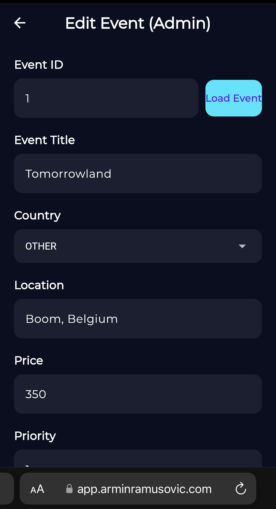

# NeoEvents Frontend

Hi! 😊 This is the frontend for my full-stack events app, NeoEvents. I originally built it to help people in my local area find and create events nearby — since there wasn’t anything like it around here. The app lets users browse upcoming local events, save ones they’re interested in, and get notifications.

I planned to publish and market it properly, but due to lack of time and motivation, it’s now mainly a portfolio project showcasing what I can do.

---

## What It Does

- Users can browse events, filter by city or category, and search. 
- Users can submit event requests. To avoid spam, these are just requests — sent to me by email.
- I (or anyone I give admin access) review these requests and create official events.
- Admin users get extra UI buttons that regular users don’t see, like creating or editing events.
- If a user isn’t logged in and tries to access some features, they get redirected to the login page.
- It’s an MVP but has solid features and could easily go live as is.
  
### Note:  
Instead of local city names, the city filter uses an enum of European countries (like Spain, France, Germany) to make it more familiar for anyone reviewing my portfolio.

---

## Try It Out

- **Live app:** [https://app.arminramusovic.com](https://app.arminramusovic.com)
- **Backend repo:** [https://github.com/Amo0802/events-amo-backend](https://github.com/Amo0802/events-amo-backend)

---

## Admin UI Overview

<table>
  <tr>
    <td align="center">
       
      <em>Home screen – admin user has a button on the top right that normal users don't</em>
    </td>
    <td align="center">
       
      <em>Top-right button lets admin user assign admin roles to other users</em>
    </td>
    <td align="center">
       
      <em>Different menu when admin user clicks on + button</em>
    </td>
  </tr>
</table>

<table>
  <tr>
    <td align="center">
       
      <em>Create event UI - with this Admin can create an event, while normal user can only request event creating</em>
    </td>
    <td align="center">
       
      <em>Edit Event UI</em>
    </td>
  </tr>
</table>

<table>
  <tr>
    <td align="center">
       
      <em>Edit Event UI when ID is entered</em>
    </td>
    <td align="center">
       
      <em>Delete Event UI</em>
    </td>
  </tr>
</table>

Admins can create, update, delete events, and assign admin permissions to other users. These options appear only after logging in with admin credentials.
If you'd like to test admin features, send me an email for credentials — I can't publish them here, because I don't want someone deleting my data.

---

## Feedback & Contributions

This is mainly a portfolio piece, but if you want to suggest improvements or report bugs, feel free to open issues or PRs!

---

Email: arminramusovic11@gmail.com
